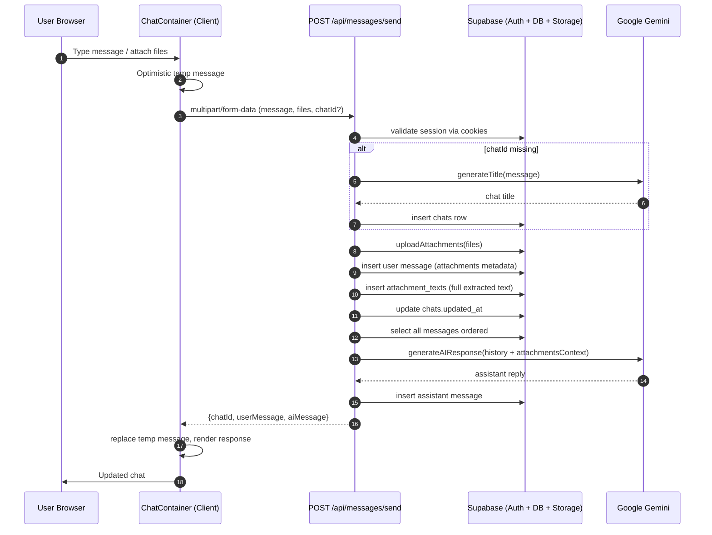
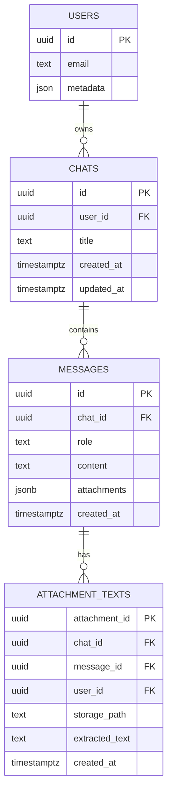

# Aether LLD Diagrams



```mermaid
flowchart TD
    A[Start UploadAttachments] --> B{File type}
    B -->|PDF| C[parsePdf(buffer)]
    C --> D{Text extracted?}
    D -->|No| E[Log parse error] --> N[Return metadata only]
    D -->|Yes| F[normalizeExtractedText]
    F --> G[cleanAndTruncateText to MAX_ATTACHMENT_CONTEXT_CHARS]
    G --> H[Set attachment.summary + extractedText]
    H --> I[fullExtractedText = normalized text]
    B -->|Image| J[describeImage via Gemini Vision]
    J --> K{Summary?}
    K -->|Yes| L[Set summary & extractedText]
    L --> M[fullExtractedText = summary]
    K -->|No| N
    B -->|Other| N
    N --> O[Upload to Supabase Storage]
    O --> P[Create signed URL]
    P --> Q[Return attachment metadata, truncated + full text]
```



